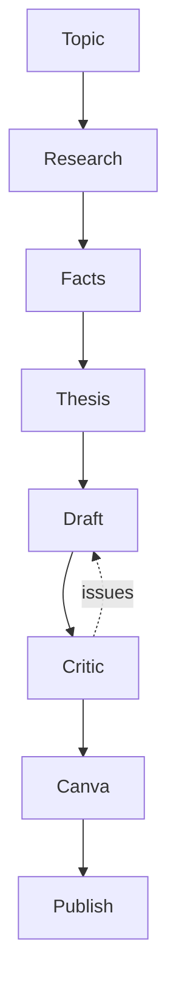

<p align="center">
  <strong>English</strong> · <a href="README.zh-CN.md">简体中文</a>
</p>

# Maomao Creator Workbench

> Turn DeepSeek Harness into a project-based AI creator workspace.

把 DeepSeek Harness 从聊天工具变成项目化 AI 内容创作工作台。

A generic creator engine + replaceable Creator Profiles. Ships with the
`maomao` profile (positioning, writing rules, quality standard, investment
rules, style rules) — fork it and add your own profile without touching engine
code. Installs as one plugin row; **no DeepSeek Harness file is modified**.

## Features

- **Full pipeline** — Topic → Research → Facts → Thesis → Draft → Critic → Canva → Publish
- **Project-based content management** — `projects/<slug>/` is the single source of truth
- **Project-aware AI Agent** — a bound session always knows its project
- **Persistent artifacts** — everything durable lives in your workspace on disk
- **Stage Guard** — an action refuses to run until its prerequisite is real
- **Content Intelligence** — on-demand knowledge loading, never a wall of rules
- **Critic Agent** — reviews drafts (score / issues / suggestions), never rewrites
- **Style Engine** — machine-checkable content quality rules
- **Creator Profiles** — replaceable positioning/series/writing/quality rules
- **Custom writing rules** — edit your workspace `knowledge/` and `style-rules.json`

## Screenshot

> Screenshot placeholder — see `docs/screenshots/` (added in a later release).

## Quick Start

```bash
git clone <your-fork-or-this-repo>
cd maomao-creator-workbench
npm install                # dev tooling (optional for install)
npm run install:local      # installs into ~/.dsh (or $DSH_HOME)
```

Then:

1. Restart Harness: stop `npx @deepseek-ai/dsh web`, run it again.
2. Click **内容项目** at the bottom of the sidebar (or the **内容项目** view tab)
   to open the Workbench.
3. Settings → **毛毛星内容工作台** shows environment status, workspace,
   series, platforms and content rules.
4. Create a project, run **深度研究 → 事实核查 → 生成观点 → 写小红书 → 内容质量检查**.

Uninstall is just as easy and never touches your content:

```bash
npm run uninstall:local    # removes the plugin row + package; projects/ & knowledge/ stay
```

## Workflow



Each stage is guarded; the Critic reviews but never rewrites the draft.

## Architecture

```
DeepSeek Harness
      │  official extension points (Slots / Remote / systemPrompt / settings)
      ▼
Maomao Creator Workbench Plugin
      │
      ▼
ContentProject ──► Workflow ──► Agent ──► Artifacts
```

Three small plugins with one ownership per service (aggregator design):

| Service | Owner |
|---|---|
| `contentProjects` | `@maomao/content-projects` |
| `contentWorkflows` | `@maomao/content-workflows` |
| `contentIntelligence` + UI + settings | `maomao-creator-workbench` |

The workbench is the **aggregator**: it injects the two provider services and
owns only the Creator UI (Workbench tab / Dashboard / ProjectDetail / Settings
card, all through official slots), Content Intelligence, and Creator Profiles.
No service is registered twice; no Harness bundle is patched.

## Customize

See [docs/customization.md](docs/customization.md):

- **Creator Profile** — create `profiles/<my-profile>/` (positioning, series,
  rules) and point the workbench at it.
- **Workspace rules** — edit the scaffolded `knowledge/**` and `style-rules.json`;
  your copy always wins.
- **Knowledge on demand** — extend `loadGroups` in `knowledge/index.json`.

## FAQ

**Do I have to use a DeepSeek model?**
No. The workbench is a Harness plugin and follows the model route configured in
your Harness profile.

**Does it modify DeepSeek Harness Core?**
No. It installs as one plugin row into your profile patch and one package into
the profile module table. No Harness installation file is edited.

**Where is my data stored?**
Only in your workspace: `projects/<slug>/`, `knowledge/`, `style-rules.json`,
`AGENTS.md`. Nothing is stored inside the plugin package.

**How do I back up?**
Back up the workspace directory (projects + knowledge). The plugin is
reinstallable from the repo at any time.

**How do I uninstall?**
`npm run uninstall:local`. Your content is never deleted.

**Will a Harness upgrade break it?**
The plugin uses documented, runtime-verified extension points. If an upgrade
changes one, only the plugin's own code needs updating (see
[docs/plugin-development.md](docs/plugin-development.md)) — never a core patch.

## Documentation

- [Architecture](docs/architecture.md)
- [Workflow](docs/workflow.md)
- [Plugin development](docs/plugin-development.md)
- [Customization](docs/customization.md)
- [CONTRIBUTING](CONTRIBUTING.md)
- [CHANGELOG](CHANGELOG.md)

## License

[MIT](LICENSE)

> Developer Preview (v0.1.0) — not production-ready. Demo data in
> `examples/demo-workspace` is fictional.
