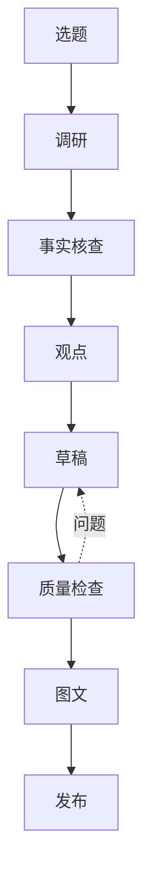

<p align="center">
  <a href="README.md">English</a> · <strong>简体中文</strong>
</p>

# 毛毛星 Creator Workbench

> 把 DeepSeek Harness 从聊天工具变成项目化 AI 内容创作工作台。
> Turn DeepSeek Harness into a project-based AI creator workspace.

通用创作引擎 + 可替换的 Creator Profile。内置默认 `maomao` Profile（定位、
写作规范、质量标准、投资纪律、风格规则）——Fork 后添加自己的 Profile 即可，
无需改动引擎代码。以一行插件挂载，**不修改任何 DeepSeek Harness 安装文件**。

## 功能

- **完整流水线** — 选题 → 调研 → 事实核查 → 观点 → 草稿 → 质量检查 → 图文 → 发布
- **项目化管理** — `projects/<slug>/` 是唯一状态源，8 个产物文件 + project.json
- **Project-aware Agent** — 绑定会话自动感知当前项目与动作
- **持久化** — 所有内容资产都在你的 workspace 磁盘上，重启不丢
- **阶段守卫** — 前置产物为空时，动作拒绝执行
- **内容智能** — 按动作按需加载知识，绝不一次灌入全部规则
- **Critic Agent** — 只审查不重写，产出 score / issues / suggestions
- **Style Engine** — 可机器检查的内容质量规则（style-rules.json）
- **Creator Profile** — 定位 / 系列 / 写作 / 质量 / 投资规则全部可替换
- **自定义写作规则** — 直接编辑 workspace 的 `knowledge/` 与 `style-rules.json`

## 截图

> 截图占位 — 见 `docs/screenshots/`（后续版本补充）。

## 快速开始

```bash
git clone <你的仓库地址>
cd maomao-creator-workbench
npm install                # 开发工具链（安装插件本身可选）
npm run install:local      # 安装到 ~/.dsh（或 $DSH_HOME）
```

然后：

1. 重启 Harness：退出 `npx @deepseek-ai/dsh web`，再重新运行。
2. 侧边栏底部点「**内容项目**」（或会话视图 Tab「内容项目」）打开工作台。
3. 设置 →「**毛毛星内容工作台**」查看环境状态、Workspace、系列、平台与内容规则。
4. 创建项目，依次执行：深度研究 → 事实核查 → 生成观点 → 写小红书 → 内容质量检查。

卸载同样简单，且绝不碰你的内容：

```bash
npm run uninstall:local    # 移除插件行与包；projects/ 与 knowledge/ 原样保留
```

## 工作流



每个阶段都有守卫；Critic 只审查、不重写草稿。

## 架构

```
DeepSeek Harness
      │  官方扩展点（Slots / Remote / systemPrompt / settings）
      ▼
毛毛星 Creator Workbench 插件
      │
      ▼
ContentProject ──► Workflow ──► Agent ──► Artifacts
```

三个小插件、每个服务单一 owner（聚合设计）：

| 服务 | Owner |
|---|---|
| `contentProjects` | `@maomao/content-projects` |
| `contentWorkflows` | `@maomao/content-workflows` |
| `contentIntelligence` + UI + 设置 | `maomao-creator-workbench` |

workbench 是**聚合插件**：注入两个 provider 服务，只拥有 Creator UI
（工作台 Tab / Dashboard / ProjectDetail / 设置卡，全部走官方 Slot）、
Content Intelligence 与 Creator Profile。任何服务都不会重复注册，**不打任何
core bundle patch**。

## 自定义

见 [docs/customization.md](docs/customization.md)：

- **Creator Profile** — 新建 `profiles/<我的-profile>/`（定位、系列、规则），切换即生效
- **Workspace 规则** — 编辑脚手架出来的 `knowledge/**` 与 `style-rules.json`，你的副本永远优先
- **按需知识** — 在 `knowledge/index.json` 的 `loadGroups` 里加自己的动作映射

## 常见问题

**必须用 DeepSeek 模型吗？**
不需要。工作台是 Harness 插件，跟随你 Harness Profile 里配置的模型路由。

**会修改 DeepSeek Harness Core 吗？**
不会。安装只是在你的 Profile patch 加一行、往 profile 模块表放一个包，不编辑任何 Harness 安装文件。

**数据存在哪里？**
只存在你的 workspace：`projects/<slug>/`、`knowledge/`、`style-rules.json`、`AGENTS.md`。插件包里不存任何用户数据。

**怎么备份？**
备份 workspace 目录即可（projects + knowledge）。插件随时可从仓库重新安装。

**怎么卸载？**
`npm run uninstall:local`。你的内容永远不会被删除。

**Harness 升级会失效吗？**
插件只用文档化且经运行时验证的扩展点。若升级改变了某个扩展点，只需更新插件自身代码（见 [docs/plugin-development.md](docs/plugin-development.md)），绝不打 core patch。

## 文档

- [架构](docs/architecture.md)
- [工作流](docs/workflow.md)
- [插件开发](docs/plugin-development.md)
- [自定义](docs/customization.md)
- [CONTRIBUTING](CONTRIBUTING.md)
- [CHANGELOG](CHANGELOG.md)

## License

[MIT](LICENSE)

> Developer Preview（v0.1.0）—— 尚未达到 production ready。
> `examples/demo-workspace` 中的演示数据均为虚构。
