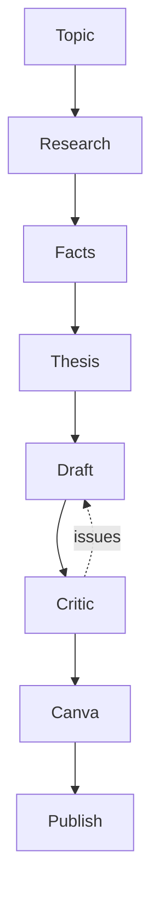

# Workflow

The workbench drives a content project through the full pipeline. Stages are
**guarded**: an action refuses to run until its prerequisite artifact has real
content (not the initial template).



| # | Stage | Artifact | Guard (requires) | Who runs it |
|---|---|---|---|---|
| 0 | Topic | `brief.md` | — | user + agent |
| 1 | Research | `research.md` | brief | agent (web search) |
| 2 | Facts | `facts.md` | research non-blank | agent (source grading) |
| 3 | Thesis | `thesis.md` | facts non-blank | agent |
| 4 | Draft | `draft.md` | thesis non-blank | agent (xhs-writing skill) |
| 4.5 | **Critic** | `critique.md` | draft non-blank | agent as reviewer — **never rewrites draft** |
| 5 | Canva | `carousel.md` | draft non-blank | agent (canva-carousel skill) |
| 6 | Publish | `publish.md` | draft non-blank | agent (publish-check skill) |

## Running a stage

- In the Workbench UI (会话视图「内容项目」或侧栏「内容项目」按钮): open a
  project, click 执行动作 (research / facts / thesis / draft / publish-check),
  or 内容质量检查 (critic).
- The host drives the project-bound session's agent with a stage prompt; the
  agent reads the prerequisite artifact + the on-demand knowledge plan, does the
  work, and writes the artifact. The UI polls `project.workflow.<action>` and
  switches to the produced file.

## Critic (Phase 4)

`critic` reviews `draft.md` against five dimensions — 事实可靠性 / 观点质量 /
用户价值 / 风格检查 / 投资内容检查 — loads only the relevant knowledge
(`content-system/quality-standard.md`, `writing/*`, `style-rules.json`, plus
investment rules when applicable) and writes `critique.md` ending with a
machine-readable JSON block:

```json
{ "score": 72, "issues": ["..."], "suggestions": ["..."] }
```

Score thresholds: ≥85 publish, 70–84 minor edits, <70 rewrite key parts.

## Knowledge on demand

`knowledge/index.json` maps action/task → files (`loadGroups`). The agent is
given the resolved paths, never the content up front, and reads only what the
current action needs (e.g. `draft` → brand/tone + writing/*; `critic` →
quality-standard + writing/*; company research → investment/company-analysis +
series + structure).
